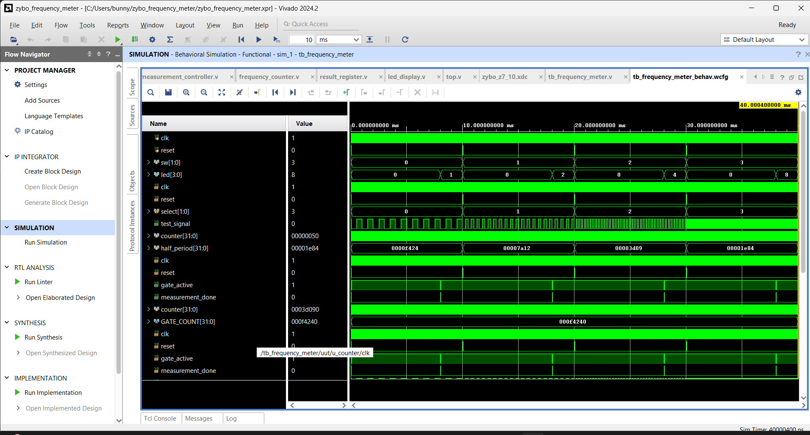

# FPGA-Based Frequency Meter with On-Board Test Signal Generator

## 📌 Project Overview

This repository contains the RTL design, simulation, implementation, and hardware verification of an **FPGA-based frequency meter with an on-board test signal generator**.

The project was implemented using **Verilog HDL** and **AMD/Xilinx Vivado 2024.2** on the **Digilent Zybo Z7-10** development board.

The system internally generates selectable test frequencies of **1 kHz, 2 kHz, 4 kHz, and approximately 8 kHz**, measures the frequency using a fixed measurement window, and displays the measured result on the onboard LEDs.

---

## 🛠️ Tools & Specifications

- **FPGA Board:** Digilent Zybo Z7-10
- **FPGA Device:** Xilinx Zynq-7000 XC7Z010
- **HDL:** Verilog
- **EDA Tool:** AMD/Xilinx Vivado 2024.2
- **Simulator:** Vivado Simulator
- **System Clock:** 125 MHz
- **Measurement Window:** 100 ms
- **Programming Interface:** JTAG

---

## 🏗️ System Architecture

The frequency meter consists of five main RTL modules:

```text
                 ┌─────────────────────┐
                 │    Zybo Z7-10       │
                 │    125 MHz Clock    │
                 └──────────┬──────────┘
                            │
             ┌──────────────┴──────────────┐
             │                             │
             ▼                             ▼
   ┌────────────────────┐       ┌────────────────────┐
   │ Test Signal        │       │ Measurement        │
   │ Generator          │       │ Controller         │
   │                    │       │                    │
   │ SW1/SW0            │       │ 100 ms Gate        │
   │ 1 kHz               │       │                    │
   │ 2 kHz               │       │ gate_active        │
   │ 4 kHz               │       │ measurement_done   │
   │ ~8 kHz              │       └─────────┬──────────┘
   └─────────┬──────────┘                 │
             │                            │
             │ test_signal                │
             └─────────────┬──────────────┘
                           ▼
                 ┌────────────────────┐
                 │ Frequency Counter  │
                 │ Rising Edge        │
                 │ Detection & Count  │
                 └─────────┬──────────┘
                           │
                           ▼
                 ┌────────────────────┐
                 │ Result Register    │
                 │ Count → Frequency  │
                 └─────────┬──────────┘
                           │
                           ▼
                 ┌────────────────────┐
                 │    LED Display     │
                 └─────────┬──────────┘
                           │
                           ▼
                      Zybo LEDs
```

### Measurement Flow

```text
SW1/SW0 Selection
        ↓
Generate Test Signal
        ↓
Open 100 ms Measurement Window
        ↓
Detect Rising Edges
        ↓
Count Signal Cycles
        ↓
Convert Count to Frequency
        ↓
Display Result on LEDs
```

---

## 📐 RTL Design

The design is divided into independent Verilog modules for easier development, simulation, and verification.

| Module | Description |
|---|---|
| `top.v` | Top-level module connecting all components |
| `test_signal_generator.v` | Generates selectable test frequencies |
| `measurement_controller.v` | Controls the 100 ms measurement window |
| `frequency_counter.v` | Detects rising edges and counts signal cycles |
| `result_register.v` | Converts measured count into frequency |
| `led_display.v` | Displays the frequency using onboard LEDs |

---

## 🔌 Hardware Interface

The project uses the onboard switches, LEDs, clock, and reset button of the Zybo Z7-10.

| Hardware | FPGA Pin | Function |
|---|---|---|
| 125 MHz Clock | `K17` | System clock |
| SW0 | `G15` | Frequency selection bit 0 |
| SW1 | `P15` | Frequency selection bit 1 |
| LED0 | `M14` | Frequency bit 0 |
| LED1 | `M15` | Frequency bit 1 |
| LED2 | `G14` | Frequency bit 2 |
| LED3 | `D18` | Frequency bit 3 |
| BTN0 | `K18` | Reset |

### Frequency Selection

| SW1 | SW0 | Selected Frequency | LED Output |
|:---:|:---:|:---:|:---:|
| 0 | 0 | 1 kHz | `0001` |
| 0 | 1 | 2 kHz | `0010` |
| 1 | 0 | 4 kHz | `0100` |
| 1 | 1 | ~8 kHz | `1000` |

---

## 🧪 Simulation Results

The complete RTL design was verified using a Verilog testbench in **Vivado Simulator**.

The simulation verifies:

- Test signal generation
- Measurement window control
- Rising-edge detection
- Frequency counting
- Frequency conversion
- LED output

### Simulation Waveform



The simulation successfully demonstrated the expected frequency transitions:

```text
1 kHz → 2 kHz → 4 kHz → ~8 kHz
```

with corresponding LED outputs:

```text
0001 → 0010 → 0100 → 1000
```

---

## 📊 Hardware Results

After successful synthesis, implementation, and bitstream generation, the design was programmed onto the **Zybo Z7-10** using JTAG.

The physical hardware produced the expected results for all four frequency selections.

| SW1 | SW0 | Expected | Hardware Output |
|:---:|:---:|:---:|:---:|
| 0 | 0 | 1 kHz | 1 kHz |
| 0 | 1 | 2 kHz | 2 kHz |
| 1 | 0 | 4 kHz | 4 kHz |
| 1 | 1 | ~8 kHz | ~8 kHz |

This confirms successful operation of the complete FPGA design on physical hardware.

---

## 🎥 Hardware Demonstration

The following demonstration shows the frequency meter operating on the **Zybo Z7-10**.

[▶️ Hardware Demonstration Video](demo/frequency_meter_demo_no_audio.mp4)

The video demonstrates the different frequency selections and their corresponding LED outputs.

---

## 📈 Results Summary

| Parameter | Result |
|---|---|
| System Clock | 125 MHz |
| Measurement Window | 100 ms |
| Test Frequencies | 1 kHz, 2 kHz, 4 kHz, ~8 kHz |
| Simulation | ✅ Passed |
| Synthesis | ✅ Passed |
| Implementation | ✅ Passed |
| Bitstream Generation | ✅ Passed |
| FPGA Programming | ✅ Passed |
| Hardware Verification | ✅ Passed |

---

## 📂 Repository Structure

```text
zybo-z7-frequency-meter/
│
├── constraints/
│   └── zybo_z7_10.xdc
│
├── demo/
│   └── frequency_meter_demo_no_audio.mp4
│
├── docs/
│   └── simulation_results.png
│
├── rtl/
│   ├── top.v
│   ├── test_signal_generator.v
│   ├── measurement_controller.v
│   ├── frequency_counter.v
│   ├── result_register.v
│   └── led_display.v
│
├── simulation/
│   └── tb_frequency_meter.v
│
├── .gitignore
└── README.md
```

---

## 🚀 Future Improvements

Possible extensions of the current design include:

- External frequency input
- Seven-segment display output
- UART-based frequency reporting
- OLED/LCD display
- Higher-frequency measurement
- Automatic frequency range selection
- Improved asynchronous input synchronization

---

## 📌 Project Status

**Completed and Hardware Verified ✅**

The complete FPGA frequency meter was successfully simulated, synthesized, implemented, programmed, and tested on the **Digilent Zybo Z7-10**.
